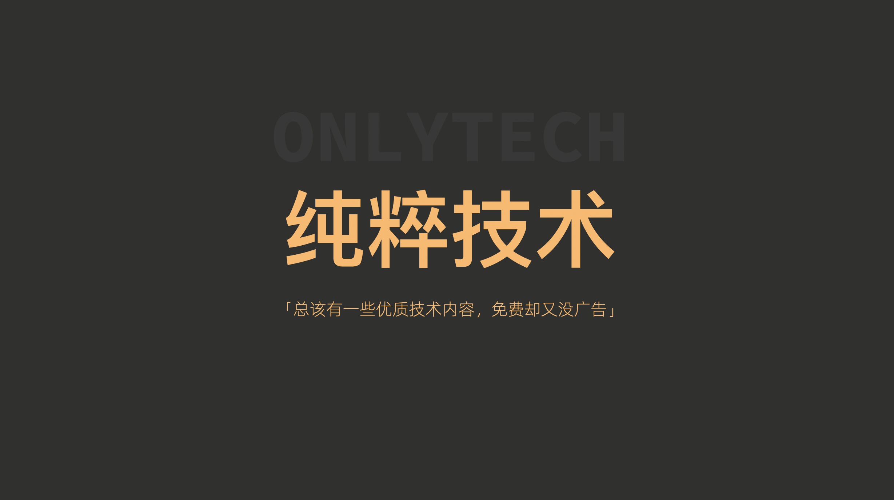
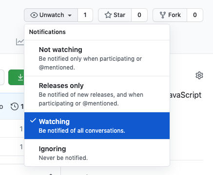

# 《现代JavaScript教程》视频课

纯粹技术免费课计划·现代JavaScript 教程

  

## 什么是纯粹技术计划

纯粹技术是一个非盈利的课程制作项目，目前专注于将优质开放的文字教程制作为视频课。《现代 JavaScript 教程》是其第一个项目。

## Watch Repo，订阅更新

  

## 制作进度

目前正在进行一期制作，内容包括 1.x 和 2.x 的全部内容。因采用并行制作，所以课程的发布并不按顺序。

## 已完成课程目录

- 1.1 [JavaScript简介](https://www.bilibili.com/video/BV1Gp4y1r7K3) 制作人 [Easy](https://weibo.com/easy)
- 1.2 [手册与规范](https://www.bilibili.com/video/BV1VA411x7N5/) 制作人 [Four](http://neychang.com) 
- 1.3 [代码编辑器](https://www.bilibili.com/video/BV19Z4y137KW/) 制作人 [雨中歌者](https://weibo.com/esinger) 

## 版权说明

- 「现代JavaScript 教程」系列视频课程由「纯粹技术·免费课计划」根据 [JavaScript.info](https://javascript.info/) 的图文课程[中文版](https://zh.javascript.info/)制作，并[按其授权](https://javascript.info/terms)免费发布。